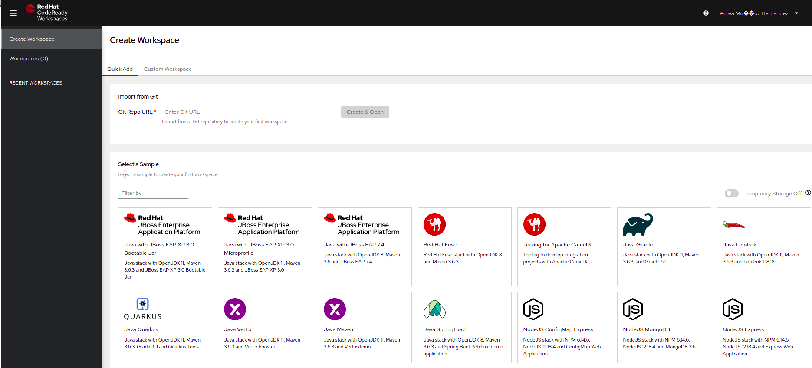

# Quarkus Challenge

## Introduction

The main goal will be for you to create a Microservice to expose simple CRUD-like capabilities using Quarkus. The Quarkus Application you are coding should expose
a REST API that allows operations on books stored in a Postgres database. If you have never used Quarkus before, check the participant guide or the `Useful links` section where you will find some learning resources.

Whether you were able to attend the workshop before the Games or not, you can check the [workshop instructions](https://red-hat-developer-games.github.io/) and the code in the `solution` branch of the [Workshop GitHub repository](https://github.com/Red-Hat-Developer-Games/quarkus-workshop/tree/solution).

## Prerequisites

First, make sure you have a Web browser installed on your laptop and internet connectivity. You will also need a GitHub account.

You can complete this challenge using either your own local environment or the remote one that we are providing you.

This workshop will make use of the following software and tools that you will need to install if you are using your own local environment:
- an IDE
- JDK 11+ installed with JAVA_HOME configured appropriately
- Apache Maven 3.8.1+
- Access to an OpenShift cluster (we will provide it)
- The `oc` CLI utility (Optional. Only required for manually deploying)

If you don't have the above tools and don't want to spend time installing them, you can also use the Code Ready Workspace that we will provide. 
This remote development environment can be accessed via CodeReady Workspaces (CRW) through your local browser, you just need to sign up and configure some elements. Your environment includes also Red Hat’s OpenShift Container Platform (OCP).

### CodeReady Workspaces

CodeReady Workspaces is a collaborative Kubernetes-native development solution that delivers OpenShift workspaces and in-browser IDE for rapid cloud application development.


#### CRW access

- Choose an user. This user will be used to access the CRW and the OpenShift Web Console.
- Launch the CRW creation by clicking the CodeReady Workspaces link (specific to your team) mentioned in the access data email.
- Once the CRW creation done, access to your CRW and sign up with your own user (selected previously) and full fill the form:

  user: USERNAME
  pwd: openshift
  email: USERNAME@ocp.com
  first name: John
  last name: Sanchez

If everything goes well, you should have land to the Workspace creation page:



You can now create your workspace either using a template (the Quarkus template).
Once created you should have a CodeReady Workspace ready to start to code: 


Finally, open a terminal from the Terminal menu -> Open Terminal in specific container -> maven and make sure the following commands work on your CRW terminal

```
$ java -version
$ mvn -version
$ curl --version
```

### OpenShift Container Platform

Your environment includes Red Hat's OpenShift Container Platform (OCP).

Access to your OCP resources can be gained via both the `oc` CLI utility and the OCP web console (you should have received the URL by email)

The project we are going to develop will contain 1 microservices accessing to a PostgreSQL database. 
In the terminal of your CRW, authenticate into OpenShift as a non cluster admin user (USERNAME) using the `oc` utility.

NOTE: You can get the command for authenticating from the OpenShift Web Console.

```
$ oc login
```

There are 2 namespaces (OpenShift projects) in your OpenShift cluster:
The namespace for hosting your CRW environment is USERNAME-codeready where `USERNAME` correspond to your specific username.
The namespace for hosting database and microservice is USERNAME-quarkus-challenge.

NOTE: change the USERNAME with your own.

Your environment comes pre-installed with an PostgreSQL database. You can verify the availability of database with the following command:

```
curl http://library-database.USERNAME-quarkus-challenge:5432
```

You should have the following response:

```
curl: (52) Empty reply from server
```

Congratulations! Your environment is now ready to use.

## The Library Quarkus Application

Throughout this challenge we propose to use the following JPA Entity:

```java
package com.santander.games.challenges.quarkus;

import javax.persistence.Entity;
import javax.persistence.Id;

@Entity
public class Book {

    @Id
    private Integer id;

   public String name;

   public Integer publicationYear;

    public Integer getId() {
        return id;
    }

    public String getName() {
        return name;
    }

    public Integer getPublicationYear() {
        return publicationYear;
    }
}
```

You have to provide a CRUD service exposing the following endpoints over REST:
- An endpoint returning all the books stored in the database. Suggested path to access this endpoint: `/books`, `/all`
- Endpoint allowing to retrieve a book by his name. Suggested path to access this endpoint: `/books/{name}`, `/books/byName/{name}`
- Endpoint allowing to retrieve a book which the publication year is between two provided values. Suggested path to access this endpoint: `/books/{lowerYear}/{higherYear}`, `/books/byPublicationYearBetween/{lowerYear}/{higherYear}`
You can of course add others endpoints if you want.

You are encouraged to use Hibernate ORM with Panache for Relational Database access but if you are a Spring Developer, you could be interested in using the Quarkus Spring extensions. 
Quarkus provides a compatibility layer for Spring Data JPA repositories in the form of the spring-data-jpa extension. Take a look at what is available in the Quarkus.io site

## Bootstrapping the project

First, you need a new project. The easiest way to create a new Quarkus project is to open a terminal and run the following command:

```shell
mvn io.quarkus.platform:quarkus-maven-plugin:2.2.1.Final:create \
    -DprojectGroupId=org.acme \
    -DprojectArtifactId=quarkus-challenge \
    -DclassName="org.acme.getting.started.GreetingResource" \
    -Dpath="/hello"
```
This command allows to bootstrap a maven based application and creates a JAX-RS endpoint.
NOTE: check the last Quarkus version available in the [site](https://quarkus.io/)

[comment]: <> (Then, depending on the implementation that you have chosen, Hibernate ORM with Panache or Quarkus Spring extensions, you should add the corresponding dependencies to the `pom.xml`.)

As already mentioned, the application that you are coding allows operations on books stored in a Postgres database, thus you need a Postgres database. 
When testing or running in dev mode you should use the postgres database provided out of the box by DevServices from Quarkus. Check how it works [here](https://quarkus.io/guides/datasource#dev-services)

The following SQL statements will help you to populate the database. To load them when Hibernate ORM starts, add an import.sql file to the root of your resources directory and add the relevant configuration properties in `application.properties`.
```sql
INSERT INTO book(id, name, publicationYear) VALUES (1, 'Sapiens' , 2011);
INSERT INTO book(id, name, publicationYear) VALUES (2, 'Homo Deus' , 2015);
INSERT INTO book(id, name, publicationYear) VALUES (3, 'Enlightenment Now' , 2018);
INSERT INTO book(id, name, publicationYear) VALUES (4, 'Factfulness' , 2018);
INSERT INTO book(id, name, publicationYear) VALUES (5, 'Sleepwalkers' , 2012);
INSERT INTO book(id, name, publicationYear) VALUES (6, 'The Silk Roads' , 2015);
INSERT INTO book(id, name, publicationYear) VALUES (7, 'The culture map' , 2016);
INSERT INTO book(id, name, publicationYear) VALUES (8, 'Billy Summers' , 2021);
INSERT INTO book(id, name, publicationYear) VALUES (9, 'The Handmaids Tale' , 2016);
INSERT INTO book(id, name, publicationYear) VALUES (10, 'The Institue' , 2019);
```

For prod mode, as this exercise is focused on creating the Quarkus Application, you will be provided all the resources needed to have a Postgres database running in the Openshift cluster. You will only need to configure the Quarkus Application to connect such Database.

Now you should be ready to run the boostraped application. The dev mode is an awesome mode that Quarkus has that allows you to write code and get the result of your changes without having to restart the application at all.
To start the application in `dev` mode use: `./mvnw compile quarkus:dev`.

This will also listen for a debugger on port 5005. If you want to wait for the debugger to attach before running you can pass `-Dsuspend` on the command line. If you don’t want the debugger at all you can use `-Ddebug=false`.

Once started, you can request the provided endpoint: 
```shell
curl -w "\n" http://localhost:8080/hello
```

Now you are set! Depending on the implementation that you have chosen, Hibernate ORM with Panache or Quarkus Spring extensions, add the corresponding dependencies to the `pom.xml` and start coding the Library Application!

## Packaging and run the application
The application is packaged using `./mvnw package`. If you used the suggested command in the `Bootstrapping the project` section, you should have a `README.md` file that will help you with some basic commands.

## Containerization and deployment in OpenShift
In the second part of the challenge, once the Quarkus Application is coded and is accepting requests locally (or in the CodeReady Workspaces environment) , you should package it and deploy it to the provided the OpenShift Cluster. 
For that, I recommend using the [Quarkus OpenShift extension](https://quarkus.io/guides/deploying-to-openshift). This extension offers the ability to generate OpenShift resources. 
Once the resources have been generated, during the `./mvnw package`, you can deploy them by running the command `oc apply -f path_to_file`.

If you are not familiar with the OpenShift client, the `oc` command, pass the `quarkus.kubernetes.deploy` flag in the command line to build and deploy the application in a single step.

Make sure that you are logged into the cluster and using the USERNAME-quarkus-challenge.

## Useful links

- [Quarkus Spring Extensions Guides](https://quarkus.io/guides/#compatibility)

- [Accessing a Database](https://quarkus.io/guides/hibernate-orm-panache)

- [Creating your first Quarkus application](https://quarkus.io/guides/getting-started)

- [Debugging and tools](https://quarkus.io/guides/tooling)

- [DevServices Demo](https://www.youtube.com/watch?v=yiFjAru09l8)

## Deliverables:
In order to verify that the challenge has been completed, we expect a file containing the url to access the microservice on OpenShift and the url to the GitHub repository containing the code. (.txt doc with 2 urls).


## Need help?

Remember that we are all here to answer any questions and support you during all the Developer Games:

DevelopergamesEMEA@redhat.com